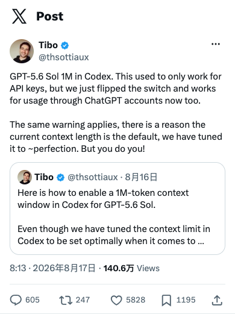
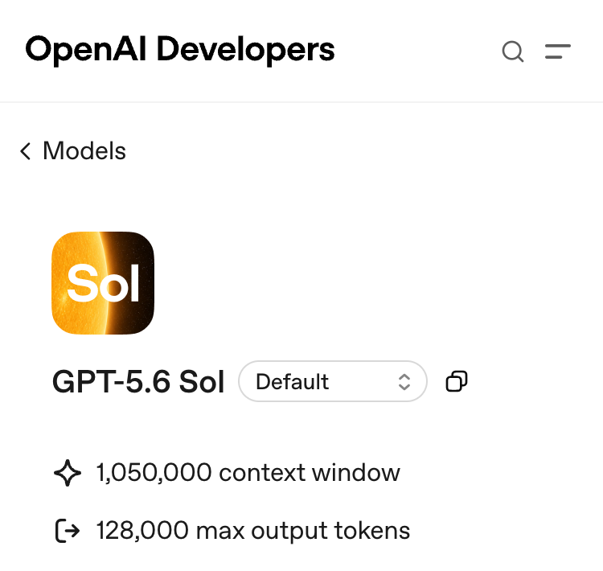
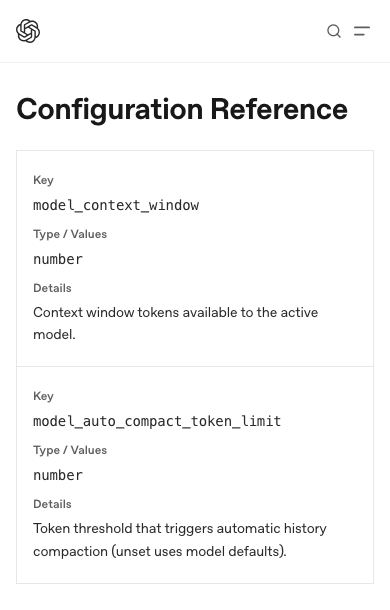

# GPT-5.6 Sol 1M 上下文向 ChatGPT 账号开放

8 月 17 日，负责 Codex 与 ChatGPT 的 OpenAI 工程师 Tibo 在 X 上表示，GPT-5.6 Sol 的 1M 配置此前只支持 API Key，现在也支持 ChatGPT 账号用量。

一个仓库任务跑得够久，Codex 到后半程还可能需要前面读过的代码、工具输出和对话。1M 让这些材料在上下文里留得更久，晚一点再被压成摘要。

Tibo 同时说，现有默认窗口已经按性能和成本调过。1M 适合任务后半程还要翻早期材料的长任务，普通任务未必需要这么大的窗口。

## 1M 会把历史压缩往后推

Codex 在任务开头读过一段代码，经过几轮工具调用后，可能还要回头核对它。原文仍在活跃上下文里时，Codex 可以继续使用；如果原文已经被压缩，后续步骤只能依赖摘要留下的信息。

Tibo 说，使用 1M 配置后，更多代码、工具输出和对话会留在活跃上下文里，系统也会更晚压缩旧材料。

OpenAI 给出的正式数字是：总上下文 1.05M，最大输入 922K，最大输出 128K。这里的 1M 只是个顺口的简称，并不表示一轮可以提交 100 万 token 的用户输入。仓库文件之外，工具输出和对话也会占用这部分空间。

容量更大，并不等于模型更会找材料。窗口快满时，Codex 能不能准确找回前面的内容，还要靠独立的长任务测试来回答。

## 1M 和 900K 是配置请求值

Tibo 给出的配置有三项：选择 `gpt-5.6-sol`，把 `model_context_window` 设为 1M，再把 `model_auto_compact_token_limit` 设为 900K。长期写入配置或只对单次命令启用，改的都是后两项数值。

配置里可以填 1M 和 900K，Codex 运行时仍会按模型的实际窗口截顶。900K 也不保证压缩会刚好在这个数字上发生。

能不能开到 1M，首先取决于账号里有没有 Sol。OpenAI 已在桌面端、Web、CLI、IDE 和 Cloud 提供这个模型；没有 Sol 的账号，改配置也不会多出这个入口。

## 历史变长，用量才增加

把上限调到 1M，不等于每条消息都按 1M 计算。会话留住的历史越多，后面的消息带上的内容也越多，用量会跟着增加。

API 用户还要留意 272K 这条线：输入一旦超过它，整次请求按 2 倍输入、1.5 倍输出计价。ChatGPT 账号的用量是否采用同样的倍数，OpenAI 暂时没有说明。

更大的窗口也会把过期日志和废弃方案留得更久。它只负责装下更多内容，不会替 Codex 判断哪些材料已经没用了。

按 Tibo 的说法，1M 仍是一项按需配置，Codex 的默认窗口没有改变。它会覆盖哪些套餐、地区和入口，接近上限时长任务表现如何，OpenAI 还没有公布。
