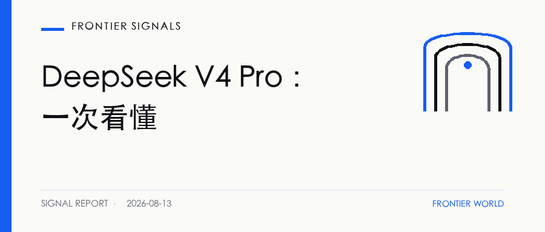
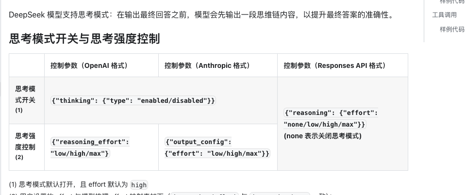
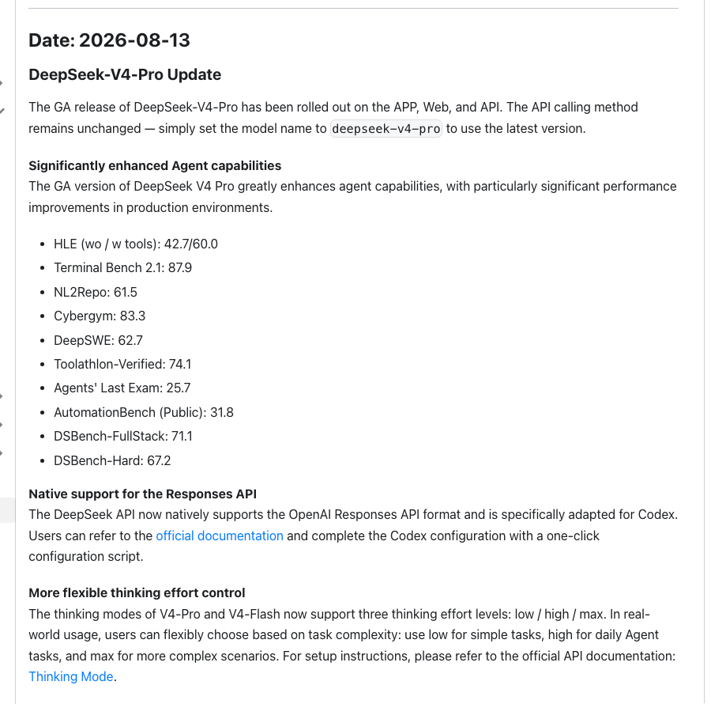
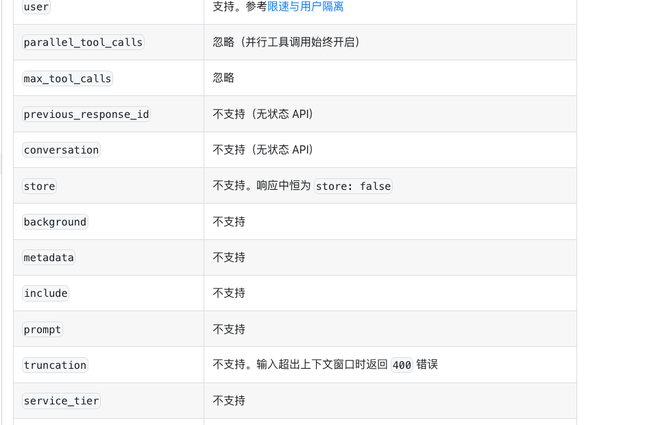

# DeepSeek V4 Pro 正式上线：Agent 能力、Codex 接入、价格与限制一次看懂

> DeepSeek 已经把 V4 Pro 推到 Agent 工作流入口。团队现在可以开始试用，稳定交付仍取决于状态保存、失败处理和不可逆动作控制。

**Frontier Signals · 2026.08.13 · 6 分钟**

[微信公众号原文](https://mp.weixin.qq.com/s/j2g7cHsIXIxNteKUNXid1g)

## 01 · 一次更新补齐了模型和入口

8 月 13 日，DeepSeek V4 Pro 正式版同步上线 App、网页和 API。已经接入 DeepSeek 的团队不用换模型名，deepseek-v4-pro 会指向新的 0813 版本。

这次更新把十项 Agent 成绩、Responses API、Codex 接入、三档思考强度和新价格一起放了出来。消息很多，方向却很集中。DeepSeek 正在把 V4 Pro 从聊天模型推向能够连续调用工具的工作模型。

我们对照了更新日志和几页接口文档。V4 Pro 已经有了进入 Agent 工作流的模型能力和调用入口，长期任务需要的状态保存、后台执行与失败恢复还要由应用完成。团队现在可以开始试用，距离稳定交付仍隔着一段运行时工程。

DeepSeek 公布的十项成绩里，Terminal-Bench 2.1 为 87.9，NL2Repo 为 61.5，Toolathlon-Verified 为 74.1。HLE 使用工具后的成绩从 42.7 上升到 60.0。这些数字来自 DeepSeek，Frontier World 没有重新运行。

接口侧的变化更直接。DeepSeek 原生支持 Responses API 格式，并提供 Codex 配置文档。Responses API 可以调用 function、服务端 web search 和 apply_patch，也提供语义化的流式事件。

V4 Pro 与 V4 Flash 增加 low、high、max 三档思考强度，默认开启思考并使用 high。当前服务页还列出 100 万 token 上下文、最高 38.4 万 token 输出和 500 并发。更新日志没有说这些服务属性都在 8 月 13 日首次出现。

## 02 · 三项基准测的是三种工作

Terminal-Bench 2.1 把 Agent 放进容器和终端，任务来自软件工程、机器学习、安全和数据处理。模型要执行命令，结果由可验证规则检查。87.9 分说明 V4 Pro 已经能处理相当一部分终端任务。

NL2Repo 从一份自然语言需求和空目录开始，要求 Agent 生成一个完整仓库。模型要先拆需求，再创建文件，还要让不同模块能够一起运行。61.5 分提供了长程编码能力的一个参照。

Toolathlon-Verified 使用六百多种真实软件工具，任务需要多轮调用才能完成。74.1 分对应的是工具选择和连续执行。三项放在一起，V4 Pro 在环境操作、仓库生成和多工具协作上都给出了可用信号。

榜单仍然没有回答生产中的几个问题。DeepSeek 没有公开逐题轨迹、重复运行分布、延迟和人工接管次数。DSBench-FullStack 与 DSBench-Hard 还是内部测试集。单次高分可以推动试用，采购和上线要等自己的重复测试。

评测配置也会改变结果。Agent 使用什么工具说明，允许多少次调用，失败后能否重试，都会落进最后的分数。团队复测时要固定模型版本、思考强度、工具权限和验收脚本。

## 03 · 长任务的状态留在应用里

Responses API 文档把责任边界写得很清楚。previous_response_id 与 conversation 暂不支持，store 会固定成 false。background 和 context_management 也不支持。应用不能把一段长任务交给服务端，再只靠响应 ID 续上。

图片和文件输入目前不可用。file_search、code_interpreter、computer_use 与 MCP 等内置工具会被忽略。custom 工具只支持 apply_patch。团队需要根据这些限制安排工具，并给文件和命令设置权限。

文档也没有提供自动截断。输入超出上下文窗口会返回 400 错误。应用需要提前计算长度，决定保留哪些历史、工具结果和文件片段。上下文整理做得不好，100 万 token 也会被无关内容占满。

一次请求能带很多上下文，任务仍不会自动拥有持久记忆。应用要保存消息、工具结果和中间文件。任务中断以后，系统还要知道哪些动作已经完成，哪些结果可以复用。

恢复需要检查点和调用日志。代码修改可以放在分支里，测试通过后再合并。发布、付款和不可逆的数据操作继续保留人工确认。模型中途停下时，这些记录决定团队要重跑十分钟，还是重做几个小时。

## 04 · 价格开始影响任务调度

截至 2026 年 8 月 13 日，V4 Pro 每百万 token 的缓存命中输入、缓存未命中输入和输出价格分别为 0.025 元、3 元和 6 元。DeepSeek 将在 8 月 17 日零点启用峰谷价格，届时空闲时段对应 0.15 元、4.5 元和 13.5 元，高峰为 0.30 元、9 元和 27 元。

“空闲半价”的比较对象是 8 月 17 日后的新高峰价。按 8 月 13 日现价计算，三项空闲价分别变为 6 倍、1.5 倍和 2.25 倍。可延后的任务仍能避开更高的高峰价，团队的预算基线却要重算。

思考强度也会影响这笔账。low 是否能完成简单任务，high 能否减少返工，max 多花的时间有没有换来更高通过率，都要用同一套任务比较。只看每百万 token 单价，很容易漏掉失败重跑和人工接管的费用。

第一轮测试不用很大。挑一件平时会花半小时、有自动验收、失败后能重跑的任务，固定代码版本与工具权限，连续执行三次。保留完整日志，再看成功率、总耗时和人工介入发生在哪里。

V4 Pro 已经给了团队一个充分的试用理由。能否进入稳定工作流，要看同一任务能不能重复交付，失败以后能不能恢复，费用能不能预测。

## 延伸阅读

- [微信公众号原文](https://mp.weixin.qq.com/s/j2g7cHsIXIxNteKUNXid1g) · Frontier World
- [更新日志](https://api-docs.deepseek.com/zh-cn/updates/) · DeepSeek API Docs
- [使用 Responses API](https://api-docs.deepseek.com/zh-cn/guides/responses_api) · DeepSeek API Docs
- [接入 Codex](https://api-docs.deepseek.com/zh-cn/quick_start/agent_integrations/codex) · DeepSeek API Docs
- [模型与价格](https://api-docs.deepseek.com/zh-cn/quick_start/pricing) · DeepSeek API Docs

— Frontier World
