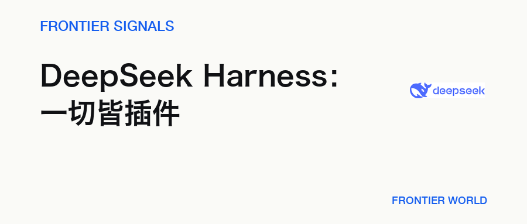
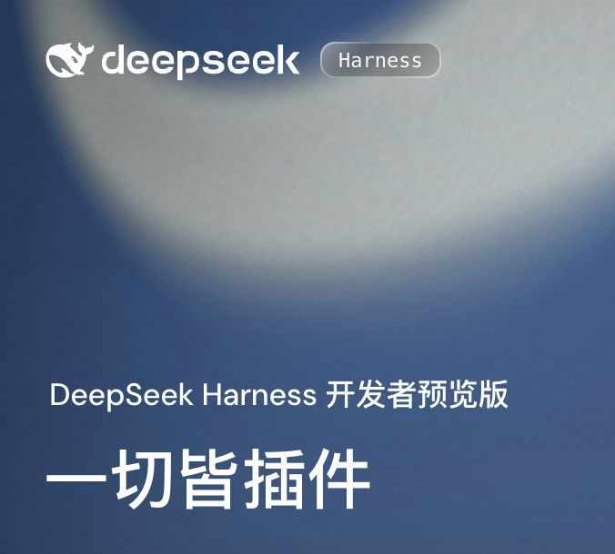
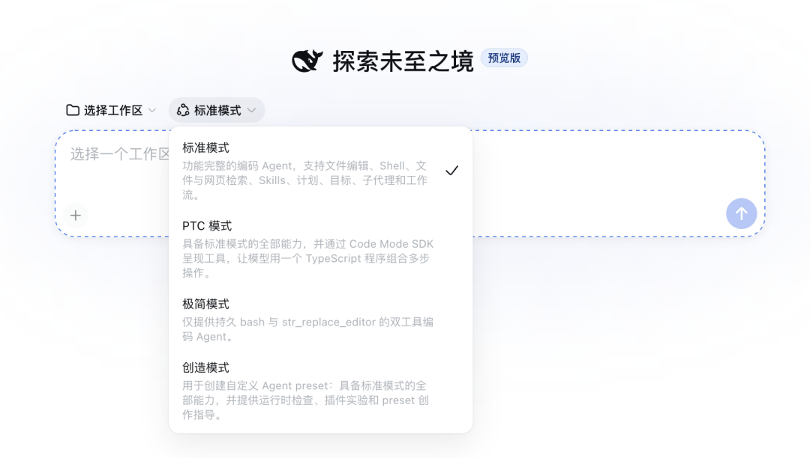

# DeepSeek Harness，把 Agent 的运行层拆成了插件

> 8 月 13 日晚，DeepSeek 开源了模型外面的那一层。模型适配器、工具、会话、沙箱、Agent Loop 和界面都进入可替换的插件层。

**Frontier Signals · 2026.08.14 · 3 分钟**

[微信公众号原文](https://mp.weixin.qq.com/s/7fpGQmASrrAqn-dS_EuOMQ)

## 01 · DeepSeek 开源了模型外面的那一层

8 月 13 日晚，DeepSeek 发布 Harness v0.1 开发者预览版，并以 MIT 协议开放源码。它已经可以在本地启动 Web 界面，也提供无界面的运行方式。

Harness 可以理解成模型与真实环境之间的运行层。模型负责理解和推理，Harness 负责把文件、终端、搜索、任务状态和权限接进来，再把一次任务持续跑下去。

这次发布仍处在很早的阶段。npm 当前的最新包是 0.1.0-rc.6，官方仓库直接提醒未来会有破坏兼容性的变化。它已经能用来测试，但还没有进入稳定版的语境。

## 02 · 模型接口、工具和 Agent Loop 都可以替换

DeepSeek 在官网上写了一条很直白的公式：Agent = Model + Harness。Harness 里的模型适配器、工具、Skills、会话、沙箱、存储、Agent Loop、调度和 UI，全部由插件提供。

底下的 Cordis 内核只处理插件加载、卸载和依赖关系。具体能力留在插件里，开发者可以通过配置替换某一层，不必改动整个框架的核心代码。

它也没有把模型锁在 DeepSeek 上。官方配置文档同时支持 DeepSeek、Anthropic、OpenAI 和自定义兼容接口。Web 与 Headless 两种运行面共用同一套底层插件，区别主要在交互方式。

会话记录采用仅追加的事件日志。模型看到的内容、工具调用和结果、子 Agent 调度、上下文注入都会留在同一条轨迹里，恢复、分叉、检索和回放也从这份记录出发。

产品端已经准备了标准、PTC、极简和创造四种模式。它们分别对应完整工具组合、用代码编排多步工具、最小双工具环境，以及在运行中组合新 Agent 预设。

## 03 · 架构已经打开，平台还要再等等

这次，DeepSeek 把 Agent 的运行底盘也交给了开发者。对已经在组合模型、工具和权限的人来说，Harness 提供了一套更容易拆开检查的结构。

插件化本身不会自动提高任务成功率。当前公开材料没有给出同一个模型、同一批任务在不同 Harness 上的对照成绩，配置层变灵活以后，版本兼容、依赖治理和插件供应链也会跟着变复杂。

接下来三个月，两个信号会决定它能走多远：外部开发者是否真的维护一批持续可用的插件，以及独立测试能否证明这套底盘在长任务里带来更稳定的结果。两者都出现，Harness 才会从一套漂亮架构长成平台。

## 延伸阅读

- [微信公众号原文](https://mp.weixin.qq.com/s/7fpGQmASrrAqn-dS_EuOMQ) · Frontier World
- [DeepSeek Harness 开发者预览版：一切皆插件](https://www.deepseek.com/harness/) · DeepSeek
- [deepseek-ai/deepseek-harness](https://github.com/deepseek-ai/deepseek-harness) · DeepSeek AI / GitHub
- [DeepSeek Harness Architecture](https://github.com/deepseek-ai/deepseek-harness/blob/master/docs/architecture.zh.md) · DeepSeek AI
- [对标 Claude Cowork：DeepSeek Harness 公测，同步开放插件生态](https://www.ithome.com/0/989/446.htm) · IT之家

— Frontier World
