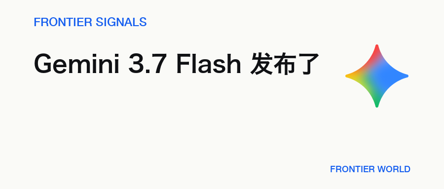
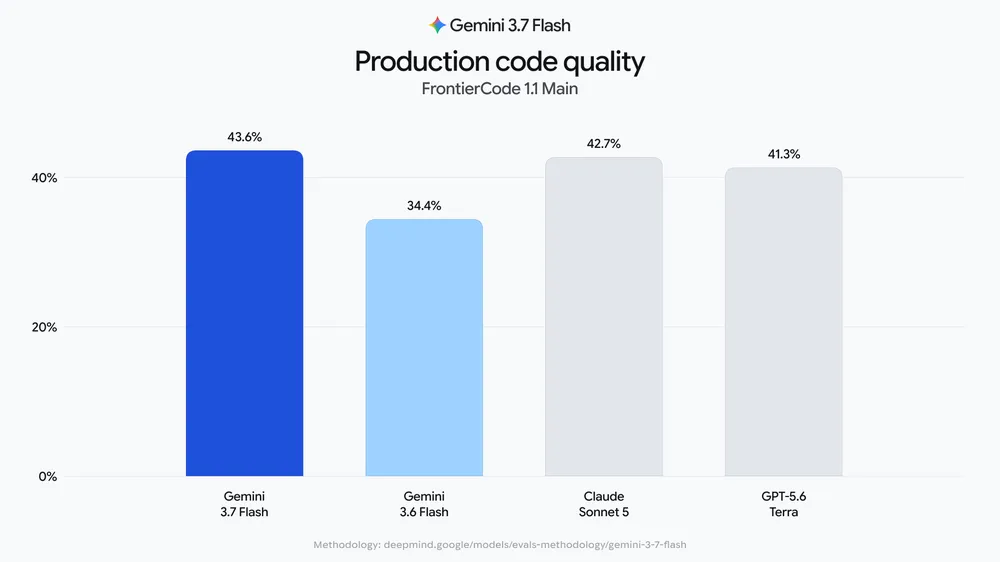
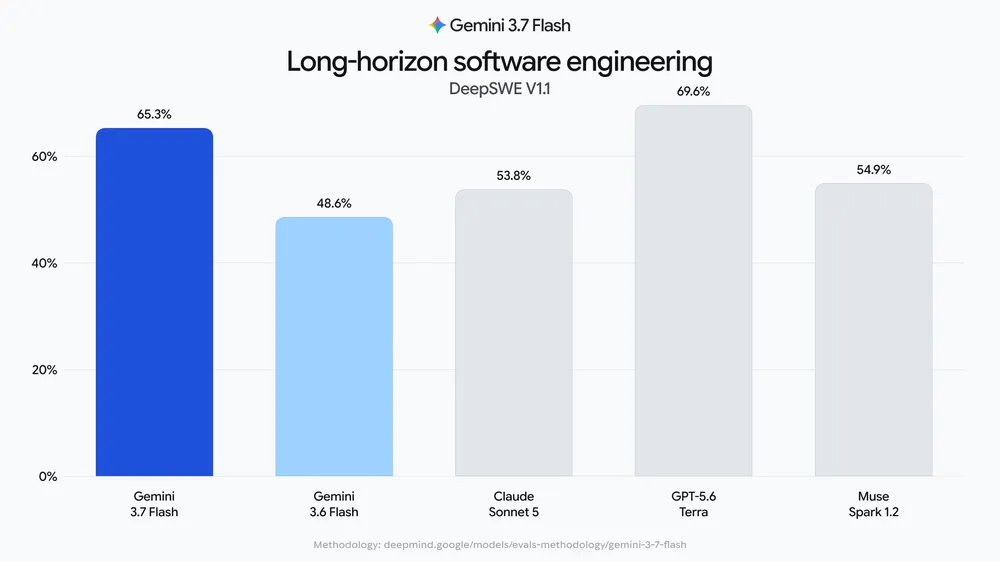

# Gemini 3.7 Flash 发布：代码能力更强，年底前半价

> Gemini 3.7 Flash 的代码评测明显提升，促销期价格与上一代相同；横向比较已有亮点，但仍未全面领先。

**Frontier Signals · 2026.08.14 · 4 分钟**

[微信公众号原文](https://mp.weixin.qq.com/s/_BNWoMa-uJQFTmqG57g3qQ)

## 01 · Gemini 3.7 Flash 已进入 API 和聊天端

8 月 14 日凌晨，Google 发布 Gemini 3.7 Flash，API 同步进入稳定版，可以用于生产环境。

距离 3.6 Flash 发布约三周，3.7 Flash 已经进入 Gemini API、AI Studio、Antigravity 和 Gemini Enterprise。Spark 也已接入，不过目前只向部分地区的 Pro 和 Ultra 用户开放。

截至 8 月 14 日下午，Gemini 聊天端的模型选择器中也已经可以使用 3.7 Flash。产品可能仍在分批开放，具体覆盖的地区与账号范围暂未公布。

3.7 Flash 的输入上限为 1,048,576 tokens，单次输出上限为 65,536 tokens。输入可以同时包含文字和图片，输出目前只支持文字。

## 02 · 代码评测的提升最明显

Google 公布的 FrontierCode 成绩中，3.7 Flash 得到 43.6%，比 3.6 Flash 的 34.4% 高出 9.2 个百分点。这项评测会把模型放进接近真实项目的代码仓库，让它直接修改代码，再检查补丁能否通过验证。

另一项 Agent 编程评测 DeepSWE 也出现了明显提升，3.7 Flash 得到 65.3%，3.6 Flash 为 48.6%。

Google 公布的两项成绩都明显高于上一代，代码与 Agent 任务也是这次更新最明确的强项。

## 03 · 和 Sonnet 5、Terra 放在一起看

与价格更高的 Claude Sonnet 5 和 GPT-5.6 Terra 相比，3.7 Flash 在 FrontierCode 1.1 中得到 43.6%，略高于 Sonnet 5 的 42.7% 和 Terra 的 41.3%。到了 DeepSWE，Terra 以 69.6% 领先，3.7 Flash 的 65.3% 排在其后，高于 Sonnet 5 的 53.8%。

企业工作流评测 AutomationBench 中，3.7 Flash 得到 30.4%，高于 Terra 的 23.6% 和 Sonnet 5 的 10.7%。综合知识工作评测 GDPVal-AA v2 则是另一番结果，3.7 Flash 的 1525 分低于 Sonnet 5 的 1598 分和 Terra 的 1578 分。

综合这四项成绩，Flash 已经能够和高价模型正面比较，不过优势并不全面。它在代码和自动化评测中表现突出，长周期编程尚未追上 Terra，综合知识工作也仍然落后。

## 04 · 半价优惠只到今年年底

2026 年 12 月 31 日前，Gemini 3.7 Flash 每百万输入 tokens 收费 0.75 美元，输出收费 3.75 美元。2027 年 1 月 1 日起，两项价格都会翻倍，分别变为 1.50 美元和 7.50 美元。

这里的“半价”是与常规价格相比。3.6 Flash 目前也在促销，因此两代模型的现价相同，3.7 Flash 并没有在 3.6 Flash 的现价上再便宜一半。

促销期内，3.7 Flash 的输入与输出价格低于 Sonnet 5 的 2 美元和 10 美元、Terra 的 2 美元和 12 美元，也低于 Muse Spark 1.2 的 1.25 美元和 4.25 美元。

对需要代码或 Agent 能力、同时看重成本的团队来说，性能提升而价格不变的组合很有吸引力，但这项价格优势只持续到今年年底。

## 延伸阅读

- [微信公众号原文](https://mp.weixin.qq.com/s/_BNWoMa-uJQFTmqG57g3qQ) · Frontier World
- [Introducing Gemini 3.7 Flash](https://blog.google/innovation-and-ai/models-and-research/gemini-models/introducing-gemini-3-7-flash/) · Google
- [Gemini 3.7 Flash Model Specification](https://ai.google.dev/gemini-api/docs/models/gemini-3.7-flash) · Google AI for Developers
- [Gemini Developer API Pricing](https://ai.google.dev/gemini-api/docs/pricing) · Google AI for Developers
- [Gemini 3.7 Flash Model Evaluation](https://storage.googleapis.com/deepmind-media/gemini/gemini_3-7_flash_model_evaluation.pdf) · Google DeepMind

— Frontier World
