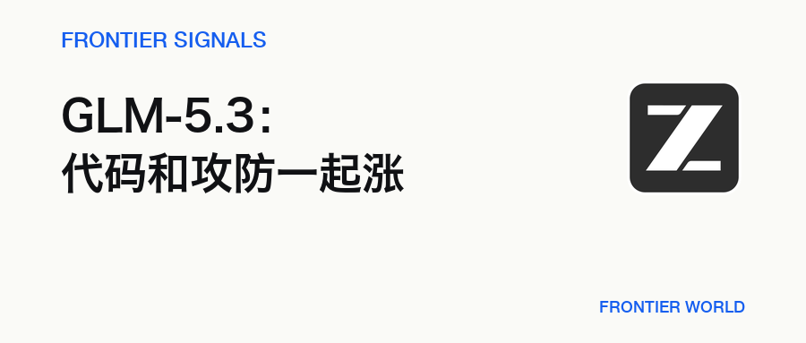
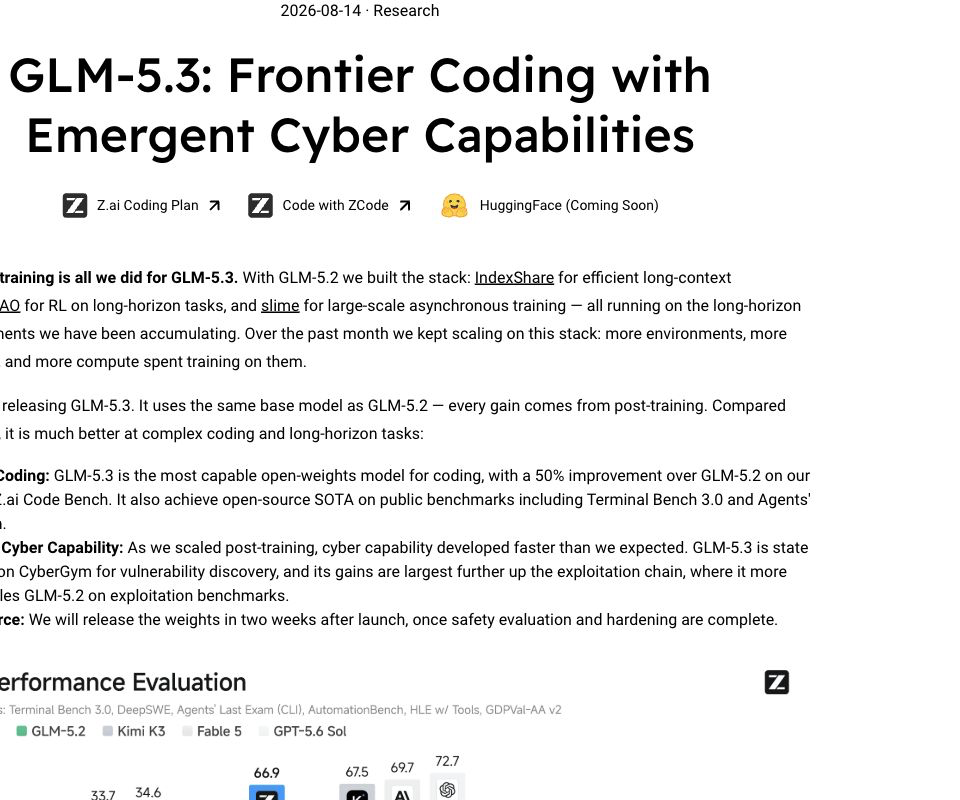
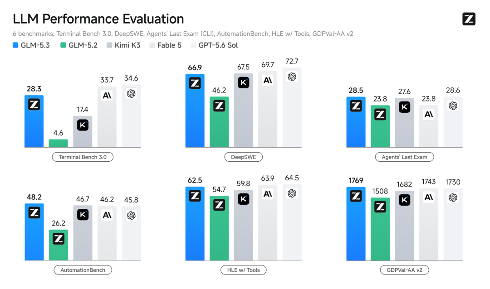
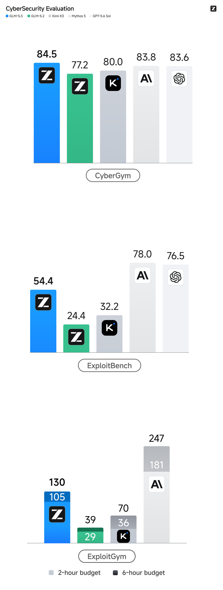

# GLM-5.3 没换底座，后训练把代码和攻防一起推高了

> 8 月 14 日，智谱发布 GLM-5.3。新模型沿用 GLM-5.2 的基础模型，变化都来自后训练。

**Frontier Signals · 2026.08.14 · 5 分钟**

[微信公众号原文](https://mp.weixin.qq.com/s/i94iZQ5EHUT6dlv18hbq7g)

## 01 · 底座没变，变化都来自后训练

8 月 14 日，智谱发布 GLM-5.3。新模型沿用 GLM-5.2 的基础模型，Z.ai 称这次能力增长全部来自后训练。

过去一个月，团队继续扩充长程任务环境和任务类型，投入更多训练算力，也把漏洞发现数据与环境纳入后训练。训练目标从短代码题走向完整工作单元：模型要面对代码库、文档、实验结果和运行环境，持续修改、测试并交付可验收的结果。

这套方法建立在 IndexShare、SAO 和 slime 上。前两者分别处理长上下文与长任务强化学习，slime 负责把训练、推理和数据流串起来。模型基座没有重做，任务环境和反馈回路被拉长了。

产品开放仍分成几层。GLM-5.3 已进入 ZCode 和 GLM Coding Plan，官方博客同时把 Hugging Face 标为 Coming Soon。完整权重计划在发布两周后开放，前提是安全评估和加固完成。

## 02 · 代码成绩跨了一截，但没有全面领先

Z.ai 公布的评测里，GLM-5.3 在 Terminal-Bench 3.0 上从 4.6 提高到 28.3。这个幅度很大，不过 Claude Fable 5 与 GPT-5.6 Sol 仍分别得到 33.7 和 34.6。

DeepSWE v1.1 也从 46.2 提高到 66.9，已经贴近 Kimi K3 的 67.5、Fable 5 的 69.7 和 GPT-5.6 Sol 的 72.7，但仍低于表中的几个闭源模型。

另外两项成绩更能看出它的长处。AutomationBench 中，GLM-5.3 得到 48.2，高于 Kimi K3 的 46.7、Fable 5 的 46.2 和 GPT-5.6 Sol 的 45.8；GDPval-AA v2 得到 1769，也高于这张表里的其他比较对象。

发布方自建的 Z.ai Code Bench 给出了 50% 的代际提升。High 档准确率为 31.4%，平均每项任务输出约 5 万 tokens；Max 档为 34.5%，平均输出约 7.5 万 tokens。Fable 5 的 Max 档准确率更高，达到 39.5%，同时平均输出接近 12 万 tokens。

这项内部测试运行在 Claude Code 2.1.207 上。Harness、工具版本和思考档位都会参与最终结果，因此 50% 不能直接外推成所有代码任务都提高一半。

这组结果说明 GLM-5.3 的进步集中在长任务、工具协作和 token 利用率上。它在部分 Agent 评测里领先，复杂编程的最高成绩仍由闭源模型保持。

## 03 · 网络攻防成了最意外的一条支线

编程能力继续增长并不意外，网络攻防的上升速度超出了发布团队自己的预期。Z.ai 称，随着长程后训练扩大，模型在漏洞发现和多阶段利用任务上的进步比预想更快。

CyberGym 中，GLM-5.3 从 77.2 提高到 84.5，略高于 Mythos 5 的 83.8 和 GPT-5.6 Sol 的 83.6。到了更深的 ExploitBench，GLM-5.3 从 24.4 提高到 54.4，提升超过一倍，但 Mythos 5 与 GPT-5.6 Sol 仍达到 78.0 和 76.5。

ExploitGym 的差距更明显。两小时和六小时预算下，GLM-5.3 分别完成 105 和 130 项，GLM-5.2 是 29 和 39 项；Mythos 5 为 181 和 247 项，GPT-5.6 Sol 为 216 和 293 项。

它已经把漏洞发现与利用链推到同一张成绩单上，同时也把双重用途摆到了发布流程中央。模型可以帮助代码审计，也能推进攻击链；发布方因此把安全评估和加固放在权重开放之前。

## 04 · 权重开放后，第三方才能给答案

官方发布页给出的 API 参数也变了。思考模式不能再关闭，只保留 low、high 和 max 三档，默认是 max；旧请求如果继续使用 disabled，会直接失败。

截至 8 月 14 日 17:28，GLM-5.3 的独立模型页仍返回 404，价格页最高只列到 GLM-5.2。调用规则已经公布；通用 API 是否已向所有账户稳定开放，仍待确认。

截至送审时，Terminal-Bench 3.0 的公开榜还没有 GLM-5.3 条目。28.3、66.9 和网络攻防成绩都来自 Z.ai 的发布评测，第三方重复运行、延迟、成本和连续成功率仍未公开。

接下来两件事会决定这次发布的分量：完整权重能否按计划在发布两周后开放，以及第三方能否复现这些大幅上涨的成绩。前者决定它能否进入开源生态，后者决定固定底座加长程后训练能不能成为一条可重复的路线。

## 延伸阅读

- [微信公众号原文](https://mp.weixin.qq.com/s/i94iZQ5EHUT6dlv18hbq7g) · Frontier World
- [GLM-5.3: Frontier Coding with Emergent Cyber Capabilities](https://z.ai/blog/glm-5.3) · Z.ai
- [GLM Coding Plan Overview](https://docs.z.ai/devpack/overview) · Z.ai Docs
- [GLM-5.3：前沿编程能力与涌现的网络安全能力](https://mp.weixin.qq.com/s?__biz=MzkyMzI3NzQ0Mg%3D%3D&mid=2247494084&idx=1&sn=a2e5cd9a534a4825feb3633ea1b6d492) · 智谱
- [Terminal-Bench 3.0 Public Leaderboard](https://frontierbench.ai/) · FrontierBench

— Frontier World
