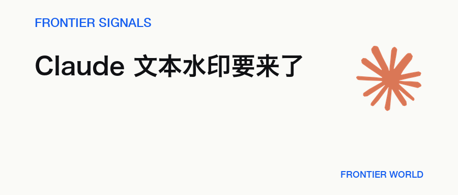
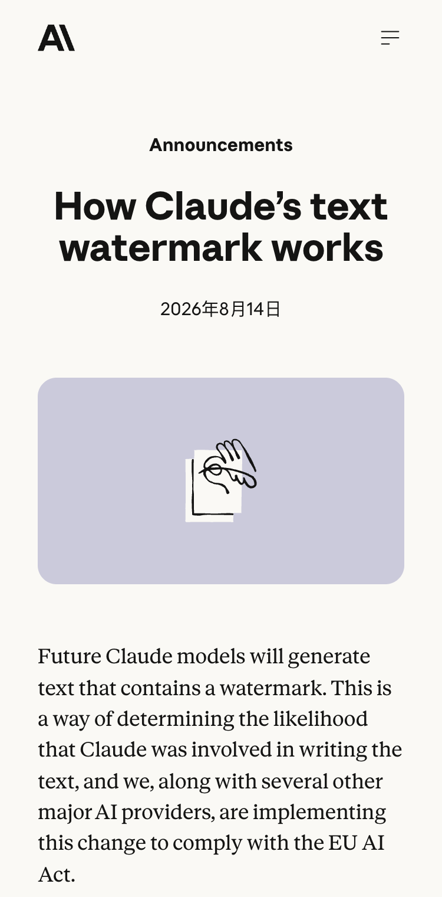
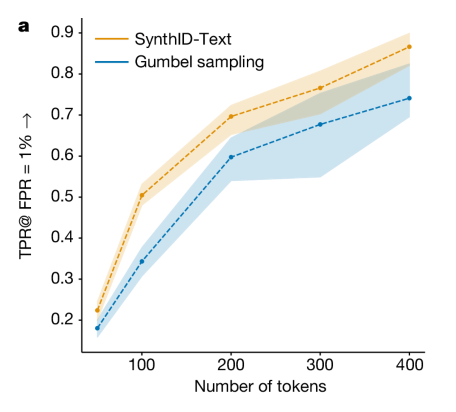

# Claude 要给文字加水印了，AI 写作还能藏住吗？

> Anthropic 将给未来 Claude 模型生成的文本加入水印。它通过许多次合理选词留下统计规律，只能说明 Claude 可能参与，不能确认作者身份。

**Frontier Signals · 2026.08.15 · 4 分钟**

## 01 · 未来 Claude 会带上水印

北京时间 8 月 15 日凌晨，Anthropic 宣布，未来 Claude 模型生成的文字会带上水印。它只提供一条 Claude 参与线索。离作者鉴定还很远。

*公告使用的是“未来 Claude 模型”，当前所有 Claude 输出并未同时切换*

## 02 · 水印藏在一连串选词里

先看一句没写完的话。“今天天气很冷，天色也很……”后面，“阴沉”和“灰蒙蒙”都说得通，“甜滋滋”就不合适。Claude 会先排除不合理的词。几个候选都不伤意思时，水印才用密钥和前文改变这次随机选择的依据。

选词仍然随机，也不会固定偏爱“阴沉”。Claude 依旧只考虑原本合理的词，密钥改变的是候选之间的随机数来源。许多次选择连在一起，才会形成可供检测的统计规律。

一次选词什么也证明不了。检测器用同一把密钥检查整段词序列，看这些选择与水印规律有多一致。文字里没有隐藏字符，也不增加 token，普通复制粘贴不会自动清掉水印。

Anthropic 称内部测试没有发现内容、创造力或可读性受影响，Google DeepMind 在接近 2000 万次 Gemini 回答的线上实验中也没有测出显著质量差异。水印不包含用户、组织或聊天身份。Anthropic 还称它对速度的影响可以忽略，使用价格不变。

## 03 · 校对、代码和翻译会怎样

水印只落在 Claude 实际选择的词上。人写好一段文字，Claude 只改语法和标点，大部分词仍由人决定，几处改动可能少到检测不出来。

代码也类似。写到“2 + 2 =”时，下一项只能是 4，水印不能为了留下信号改掉正确答案。代码注释和某些命名仍有多个合理选项。代码中的水印通常更少，主要出现在这些有选择空间的位置。

翻译的情况不同，整段文字都由 Claude 重新选择，因此会带水印。能否稳定检出仍取决于文本长度。短文本可供判断的选择少，段落越长，统计证据通常越多。

*论文测试使用 Gemma 7B-IT、temperature 0.7 和 ELI5 prompts，纵轴是在误报率固定为 1% 时的真阳性率*

## 04 · 水印到底能说明什么

即使检测结果与水印规律吻合，它也分不清 Claude 从头写了一篇文章，还是只做过一次大幅编辑。水印不能确认作者身份、作品归属或法律责任，也不能证明一段没有水印的文字就来自人类。

改写会削弱信号。Anthropic 承认，轻度编辑可能仍保留水印，逐字重写可以清除。ICML 2024 的独立研究还在不知道密钥的情况下移除了三种既有文本水印，但没有测试 Anthropic 尚未公开的实现。

## 05 · 检测工具还没有开放

现在没有官方入口可查。Anthropic 只说会“很快”开放 API，没有公布日期、权限、最低可靠长度、误报率或漏报率。8 月 2 日前发布的旧模型也要在未来几个月逐步补上水印。

这次改动来自欧盟 AI 法案的透明度要求。约 190 家机构签署了相关实践准则。Anthropic 计划上线时全球应用，因为目前还无法稳定地只为特定地区加水印。API 上线后，按长度、语言和改写程度公布的误报率与漏报率，会决定这道水印的实际用途。

## 延伸阅读

- [Anthropic 解释 Claude 文本水印](https://www.anthropic.com/news/claude-text-watermark) · Anthropic
- [SynthID-Text 论文](https://www.nature.com/articles/s41586-024-08025-4) · Nature
- [欧盟 AI 生成内容透明度准则](https://digital-strategy.ec.europa.eu/en/news/strong-backing-code-practice-transparency-ai-generated-content) · European Commission
- [文本水印的强度上限研究](https://proceedings.mlr.press/v235/zhang24o.html) · ICML 2024

— Frontier World
